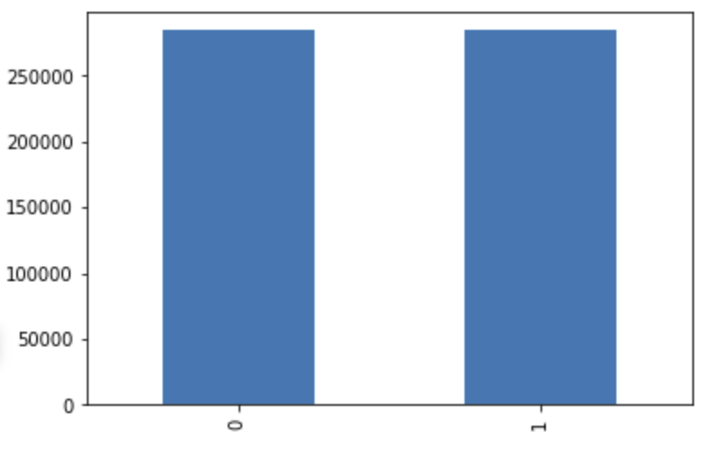
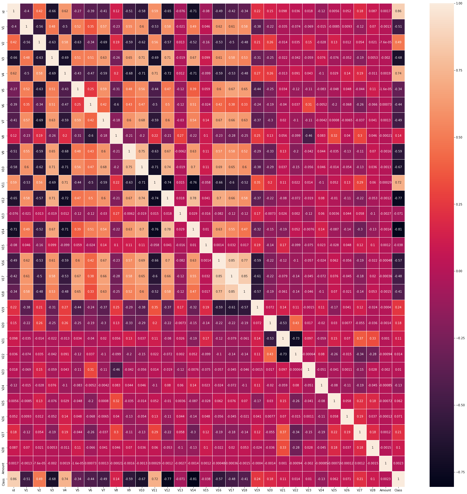
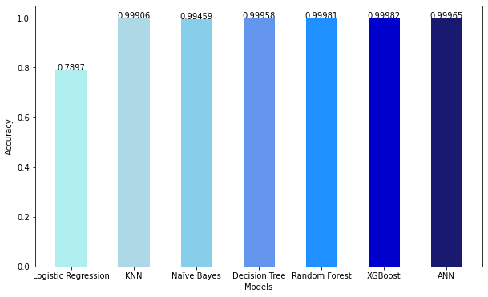
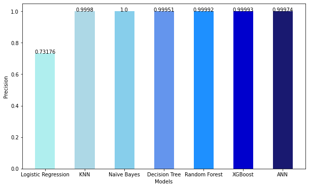
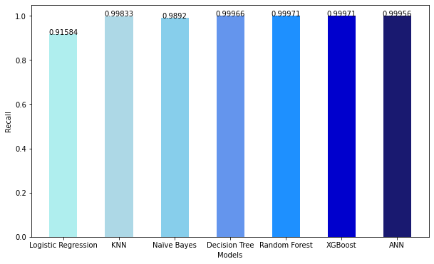

# Credit Card Fraud Detection using Machine Learning and Deep Learning

A comparative study of machine learning and deep learning models for credit card fraud detection. Developed as part of my BSc Data Science major project, this work evaluates multiple classification algorithms using a balanced credit card transaction dataset to compare their predictive performance.

---

## Project Overview

This project was developed as part of my BSc Data Science major project. It presents a comparative study of machine learning and deep learning models for credit card fraud detection using a balanced dataset obtained from Kaggle. The project includes exploratory data analysis, data preprocessing, model development, and performance evaluation across multiple classification algorithms.

---

## Dataset

- **Source:** Kaggle
- **Type:** Binary Classification
- **Dataset Used:** Balanced Credit Card Fraud Detection Dataset
- **Target Classes:** Fraudulent and Non-Fraudulent Transactions

A balanced credit card fraud detection dataset obtained from Kaggle was used to train and evaluate multiple machine learning and deep learning models for comparative performance analysis.

---

## Project Workflow

1. Data Loading
2. Exploratory Data Analysis (EDA)
3. Data Preprocessing
4. Feature Engineering / Scaling
5. Train-Test Split
6. Model Training
7. Model Evaluation
8. Comparative Analysis

---

## Repository Structure

```
Credit-Card-Fraud-Detection/
│
├── README.md
├──images/
│  ├── class_distribution.png
│  ├── correlation_matrix.png
│  ├── accuracy_comparison.png
│  ├── precision_comparison.png
│  ├── recall_comparison.png
│  └── f1_score_comparison.png
├── requirements.txt
├── 01_Data_Preprocessing_and_EDA.ipynb
├── 02_Model_Training_and_Evaluation.ipynb
├── .gitignore
└── LICENSE
```

---

## Models Used

### Machine Learning

- Logistic Regression
- Decision Tree
- Random Forest
- K-Nearest Neighbors
- Naïve Bayes
- XGBoost

### Deep Learning

- Artificial Neural Network (ANN)

---

## Evaluation Metrics

- Accuracy
- Precision
- Recall
- F1-Score
- ROC-AUC Score
- Confusion Matrix

---

## Results and Visualizations

### Class Distribution



The dataset contains an equal number of fraudulent and non-fraudulent transactions.

---

### Correlation Matrix



The correlation matrix provides an overview of the relationships between the input features used for model training.

---

### Model Performance

| Model | Accuracy | Precision | Recall | F1-Score |
|-------|---------:|----------:|--------:|---------:|
| Logistic Regression | 0.78970 | 0.73176 | 0.91584 | 0.81351 |
| K-Nearest Neighbors | 0.99906 | 0.99980 | 0.99833 | 0.99906 |
| Naïve Bayes | 0.99459 | 1.00000 | 0.98920 | 0.99457 |
| Decision Tree | 0.99958 | 0.99951 | 0.99966 | 0.99958 |
| Random Forest | 0.99981 | 0.99992 | 0.99971 | 0.99981 |
| XGBoost | **0.99982** | **0.99993** | **0.99971** | **0.99982** |
| Artificial Neural Network | 0.99965 | 0.99974 | 0.99956 | 0.99965 |

---

### Accuracy Comparison



---

### Precision Comparison



---

### Recall Comparison



---

### F1-Score Comparison


---

### Key Findings

- Multiple machine learning and deep learning models were evaluated for fraud detection.
- XGBoost achieved the highest overall performance across the evaluated metrics.
- Decision Tree, Random Forest, K-Nearest Neighbors, and ANN also demonstrated excellent classification performance.
- Logistic Regression served as a strong baseline model but performed comparatively lower than the ensemble and deep learning models.

---

## Technologies Used

- Python
- Pandas
- NumPy
- Matplotlib
- Seaborn
- Scikit-learn
- TensorFlow / Keras
- XGBoost
- Jupyter Notebook

---

## Future Improvements

- Hyperparameter tuning
- Feature selection
- Model explainability using SHAP/LIME
- Real-time fraud detection pipeline
- Model deployment as a web application

---

## License

This project is licensed under the MIT License.
